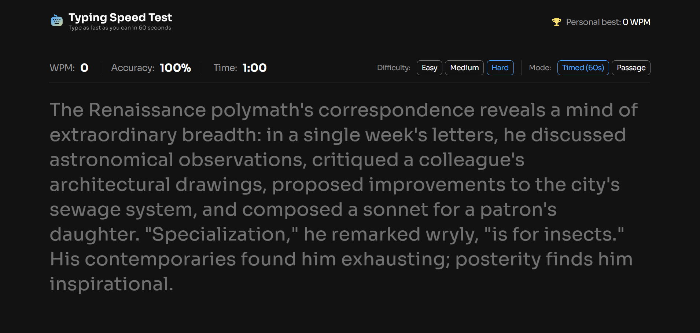

# Typing Speed Test

This is a solution to the [Typing Speed Test challenge on Frontend Mentor](https://www.frontendmentor.io/challenges/typing-speed-test). Frontend Mentor challenges help you improve your coding skills by building realistic projects. 

## Table of contents

- [Overview](#overview)
  - [The challenge](#the-challenge)
  - [Screenshot](#screenshot)
  - [Links](#links)
- [My process](#my-process)
  - [Most proud of](#most-proud-of)
- [Author](#author)

## Overview

### The challenge

Users should be able to:

Test Controls
- Start a test by clicking the passage and typing.
- Select a difficulty level (Easy, Medium, Hard) for passages of varying complexity
- Switch between "Timed (60s)" mode and "Passage" mode (timer counts up, no limit)
- Restart at any time to get a new random passage from the selected difficulty

Typing Experience
- See real-time WPM, accuracy, and time stats while typing
- See visual feedback showing correct characters (green), errors (red/underlined), and cursor position
- Correct mistakes with backspace (original errors still count against accuracy)

Results & Progress
- View results showing WPM, accuracy, and characters (correct/incorrect) after completing a test
- See a "Baseline Established!" message on their first test, setting their personal best
- See a "High Score Smashed!" celebration with confetti when beating their personal best
- Have their personal best persist across sessions via localStorage

UI & Responsiveness
- View the optimal layout depending on their device's screen size
- See hover and focus states for all interactive elements

### Screenshot

### Links

- Solution URL: [here!](https://www.frontendmentor.io/solutions/an-accessible-and-responsive-typing-speed-test-b31yYQ3hjt)
- Live Site URL: [here!](https://mohamed-devp.github.io/typing-speed-test/)

## My process

### Most proud of

- **Accessibility-first implementation**: Built the site with semantic HTML5 and appropriate ARIA attributes to ensure it's usable by screen readers and keyboard-only users—without compromising design.

- **Clean cross-device input handling**: Designed a unified input handling system that works consistently across desktop and mobile, acounting for focus behavior and touch interactions.

## Author

- Frontend Mentor - [@Mohamed-Devp](https://www.frontendmentor.io/profile/Mohamed-Devp)